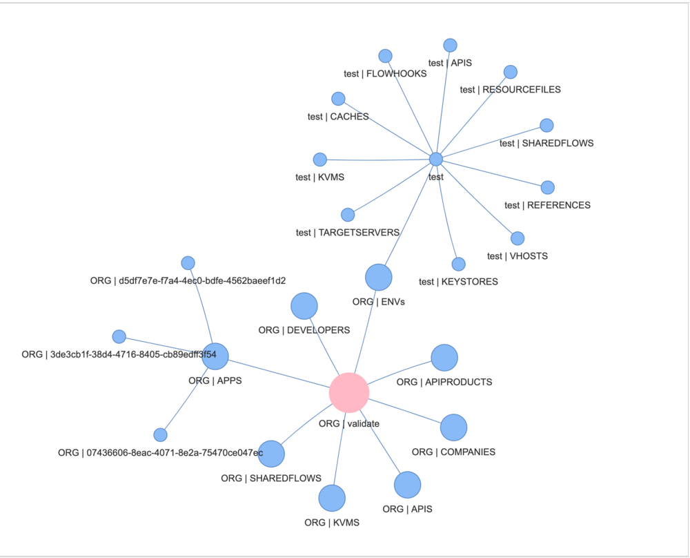

# Apigee Migration Assessment Tool

[](https://github.com/apigee/apigee-migration-assessment-tool/actions/workflows/static-checks.yml)
[](https://github.com/apigee/apigee-migration-assessment-tool/actions/workflows/tests.yml)

This tool helps you plan your migration from Apigee Edge, Apigee X, or Apigee Hybrid to a target Apigee X or Apigee Hybrid environment by analyzing your source Apigee setup and generating a comprehensive assessment report.

## Assessment Scenarios

The following migration paths are supported:

| Source Apigee Platform | Target Apigee Platform |
| :--------------------- | :--------------------- |
| Apigee Edge (SaaS)     | Apigee X               |
| Apigee Edge (SaaS)     | Apigee Hybrid          |
| Apigee Edge (OPDK)     | Apigee X               |
| Apigee Edge (OPDK)     | Apigee Hybrid          |
| Apigee Hybrid          | Apigee X               |
| Apigee X               | Apigee Hybrid          |

## Prerequisites

You can run this tool locally using Python or via a Docker container.

### Local Setup

1.  **Install Graphviz:** Follow the official installation instructions for your operating system from [graphviz.org/download/](https://graphviz.org/download/).
2.  **Create and activate a Python virtual environment:**
    ```bash
    python3 -m venv dev
    source dev/bin/activate
    ```
    *(Note: On Windows, use `dev\Scripts\activate`)*
3.  **Install Python dependencies:**
    ```bash
    pip install -r requirements.txt
    ```

### Docker Setup

1.  **Use a pre-built Docker image (recommended):**
    ```bash
    docker pull ghcr.io/apigee/apigee-migration-assessment-tool/apigee-migration-assessment-tool:latest
    ```
    **OR**

    **Build the Docker image from source:**
    ```bash
    # Build the image
    docker build -t <your-image-name>:<your-tag> .

    # (Optional) Push to your container registry
    # docker push <your-image-name>:<your-tag>
    ```

2.  **Run the Docker image:**
    *(See the "Running the Tool with Docker" section below for detailed examples.)*

## Apigee Permissions

The tool requires specific permissions to access and analyze your Apigee environments.

*   **Source: Apigee Edge (SaaS/OPDK)**
    *   Assign the `Read-only Organization Administrator` role to the user account that will be used by the tool.
    *   Refer to the [Apigee Edge built-in roles documentation](https://docs.apigee.com/api-platform/system-administration/edge-built-roles) for more details.

*   **Source/Target: Apigee X/Hybrid**
    *   The tool needs read-only access to organization and environment-level objects, plus permissions to validate APIs. Assign the following to the relevant user or service account:
        *   The built-in role: `roles/apigee.readOnlyAdmin`
        *   A custom role with the `apigee.proxies.create` permission. You can create this role using gcloud:
            ```bash
            gcloud iam roles create ApigeeAPIValidator --project=<YOUR_GCP_PROJECT_ID> \
              --title="Apigee API Validator" --description="Allows Apigee API proxy creation for validation" \
              --permissions="apigee.proxies.create" --stage=GA
            ```
    *   Refer to the [Apigee roles documentation on GCP](https://cloud.google.com/iam/docs/understanding-roles#apigee-roles) for more information.

## Tool Configuration

1.  **Prepare `input.properties`:**
    Create an `input.properties` file in the **root directory** of the project. This file contains essential configuration for the tool to connect to your Apigee environments.
    Sample input files are available in the `sample/inputs/` directory:
    *   [Edge OPDK sample: `sample/inputs/opdk.input.properties`](sample/inputs/opdk.input.properties)
    *   [Edge SaaS sample: `sample/inputs/saas.input.properties`](sample/inputs/saas.input.properties)
    *   [X/Hybrid sample: `sample/inputs/x.input.properties`](sample/inputs/x.input.properties)

    The following table details the required properties within the `[input]` section of your `input.properties` file:

    | Section | Property                | Description                                                                 |
    | :------ | :---------------------- | :-------------------------------------------------------------------------- |
    | `input` | `SOURCE_URL`            | Management URL of your source Apigee environment (OPDK, Edge, X, or Hybrid). |
    | `input` | `SOURCE_ORG`            | Name of your source Apigee organization.                                   |
    | `input` | `SOURCE_AUTH_TYPE`      | Authentication type for the source: `basic` or `oauth`.                     |
    | `input` | `SOURCE_APIGEE_VERSION` | Flavor of your source Apigee: `OPDK`, `SAAS`, `X`, or `HYBRID`.             |
    | `input` | `TARGET_URL`            | Management URL of your target Apigee X/Hybrid environment (Global or DRZ URL).|
    | `input` | `GCP_PROJECT_ID`        | GCP Project ID where your target Apigee X/Hybrid instance is running.       |
    | `input` | `TARGET_DIR`            | Name of the directory where exported Apigee objects and reports will be saved (e.g., `output`). |
    | `input` | `TARGET_COMPARE`        | Set to `true` to export apigee objects from target environment and compare with source. Set to `false` to avoid export and compare. |
    | `input` | `SSL_VERIFICATION`      | Set to `false` to ignore SSL certificate verification, or `true` to enforce it. |

2.  **Authentication Tokens:**
    Export the necessary authentication tokens as environment variables before running the tool.

    *   **For Source: Apigee Edge (SaaS/OPDK) or Apigee X/Hybrid:**
        *   **Basic Auth (Edge):**
            ```bash
            export SOURCE_AUTH_TOKEN=$(echo -n '<your-username>:<your-password>' | base64)
            ```
        *   **OAuth2/SAML (Edge):**
            Refer to the [Apigee Edge Management API documentation](https://docs.apigee.com/api-platform/system-administration/management-api-overview) for generating OAuth2 tokens.
            ```bash
            # Example using a helper script like get_token
            export SSO_LOGIN_URL=https://login.apigee.com # Adjust if necessary
            export SOURCE_AUTH_TOKEN=$(get_token -u <your-username>:<your-password> -m <your-mfa-code>)
            ```
        *   **OAuth2 (Apigee X/Hybrid as Source):**
            ```bash
            export SOURCE_AUTH_TOKEN=$(gcloud auth print-access-token)
            ```

    *   **For Target: Apigee X/Hybrid:**
        ```bash
        export APIGEE_ACCESS_TOKEN=$(gcloud auth print-access-token)
        ```
        > **Note:** This token is not required if you use the `--skip-target-validation` flag.

## Running the Tool

The primary script for running the assessment is `main.py`.

### Command-Line Arguments

*   `--resources <resource_list>`: Specifies the Apigee objects to assess.
    *   Use `all` to assess all supported resources.
    *   Provide a comma-separated list for selective assessment.
    *   **Available Environment-Level Resources:** `targetservers`, `keyvaluemaps`, `references`, `resourcefiles`, `keystores`, `flowhooks`
    *   **Available Organization-Level Resources:** `org_keyvaluemaps`, `developers`, `apiproducts`, `apis`, `apps`, `sharedflows`

*   `--skip-target-validation`: (Optional) Skips the validation of API proxies and SharedFlows against the target Apigee environment. This is useful for running the tool without needing credentials for the target environment.

    **Examples:**
    ```bash
    # Assess all resources
    python3 main.py --resources all

    # Assess only TargetServers and KVMs
    python3 main.py --resources targetservers,keyvaluemaps

    # Assess Keystores and Apps
    python3 main.py --resources keystores,apps

    # Assess all resources without validating against a target environment
    python3 main.py --resources all --skip-target-validation
    ```

### Running Locally

Ensure you have configured `input.properties` and exported authentication tokens as described above.
```bash
python3 main.py --resources <your_selected_resources>
```
> Note: `export IGNORE_VIZ="true"` can be leveraged to skip generation of graph visualization for the migration artifacts.

### Running with Docker

1.  **Create an output directory on your host machine:** This directory will be mounted into the container to store the assessment results.
    ```bash
    mkdir output
    sudo chmod 777 output # Ensure the container can write to this directory
    ```
2.  **Set the Docker image variable:**
    ```bash
    # If using the pre-built image
    export DOCKER_IMAGE="ghcr.io/apigee/apigee-migration-assessment-tool/apigee-migration-assessment-tool:latest"
    # Or, if you built your own
    # export DOCKER_IMAGE="<your-image-name>:<your-tag>"
    ```
3.  **Run the Docker container:**
    ```bash
    docker run --rm \
        -v "$(pwd)/output:/app/target" \
        -v "$(pwd)/input.properties:/app/input.properties" \
        -e SOURCE_AUTH_TOKEN="$SOURCE_AUTH_TOKEN" \
        -e APIGEE_ACCESS_TOKEN="$APIGEE_ACCESS_TOKEN" \
        "$DOCKER_IMAGE" --resources all
    ```
    *(Adjust `--resources` as needed.)*

    > Note: `-e IGNORE_VIZ="true"` can be leveraged to skip generation of graph visualization for the migration artifacts.

    To run without target validation (and without the `APIGEE_ACCESS_TOKEN`):
    ```bash
    docker run --rm \
        -v "$(pwd)/output:/app/target" \
        -v "$(pwd)/input.properties:/app/input.properties" \
        -e SOURCE_AUTH_TOKEN="$SOURCE_AUTH_TOKEN" \
        "$DOCKER_IMAGE" --resources all --skip-target-validation
    ```

    > Note: `-e IGNORE_VIZ="true"` can be leveraged to skip generation of graph visualization for the migration artifacts.

## Accessing the Report and Visualization

The tool generates the following outputs in the directory specified by `TARGET_DIR` in your `input.properties` (e.g., `./output/`):

1.  **Assessment Report:**
    *   Filename: `qualification_report.xlsx`
    *   This Excel file contains the detailed findings of the assessment.
    *   A sample report can be found at [`sample/outputs/sample_qualification_report.xlsx`](sample/outputs/sample_qualification_report.xlsx).

2.  **Topology Visualization (for OPDK source):**
    *   Filename: `visualization.html`
    *   Open this HTML file in a web browser to view a diagram of your Apigee OPDK topology.
    *   A sample visualization is shown below:
        

## Project Structure Overview

*   `main.py`: The main executable script for the tool.
*   `input.properties`: Main configuration file (user-created).
*   `backend.properties`: Internal configuration for the tool.
*   `requirements.txt`: Python dependencies.
*   `Dockerfile`: For building the Docker image.
*   `assessment_mapping/`, `assessment_mapping_json/`: Contains mappings and definitions for assessing various Apigee resources.
*   `qualification_report_mapping/`, `qualification_report_mapping_json/`: Defines the structure and content of the Excel qualification report.
*   `sample/`: Contains sample input files and an example output report.
    *   `sample/inputs/`: Example `input.properties` files for different Apigee platforms.
    *   `sample/outputs/`: An example of the `qualification_report.xlsx`.
*   `assets/`: Contains static assets like images for documentation.
*   `.github/`: GitHub Actions workflows for CI/CD (linting, testing, publishing).

## Contributing

We welcome contributions from the community! If you would like to contribute to this project, please see our [Contribution Guidelines](./CONTRIBUTING.md).

## License

All solutions within this repository are provided under the [Apache 2.0 License](https://www.apache.org/licenses/LICENSE-2.0). Please see the [LICENSE](./LICENSE) file for more detailed terms and conditions.

## Disclaimer

This repository and its contents are not an official Google product.
